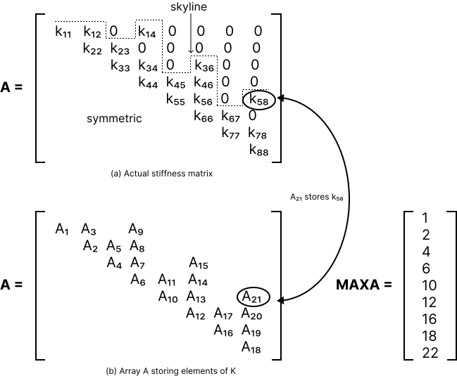

## colsol

**colsol** is a column-oriented direct solver for linear systems, designed to
compute an **LDLᵀ factorization** of a stiffness matrix or to perform reduction
and back-substitution of a load vector.

---

## Overview

This crate implements a simple **direct solver** for linear systems using
column-oriented Gaussian elimination.

The goal of this project is **not** to provide a production-ready linear algebra
library, but to explore how direct solvers work internally and how classical
numerical algorithms can be expressed clearly and safely in Rust.

The implementation is intentionally explicit and close to the underlying
mathematics, making it suitable for learning, experimentation, and reference.

---

## Motivation

This crate was written as part of a broader effort to revisit numerical methods
from first principles.

Having previously worked with engineering and finite-element analysis (FEA)
tools, I wanted to better understand how linear solvers are implemented
internally — both to strengthen my numerical background and to support later
work involving sparse systems, iterative methods, and GPU-based computation.

---

## Direct vs Iterative Solvers

This project focuses on **direct methods**, where a linear system is solved
in a finite number of algebraic steps (e.g. Gaussian elimination and matrix
factorization).

In contrast, **iterative methods** (such as Conjugate Gradient or PCG) are
explored in the companion crate:

- [`iterative_solvers`](https://github.com/RomanShushakov/iterative_solvers)

Both approaches are widely used in numerical computing.  
This crate serves as a conceptual foundation for understanding more advanced
solver techniques.

---

## Solver Characteristics

- Method: column-oriented Gaussian elimination
- Factorization: **LDLᵀ**
- Matrix type: symmetric, positive definite
- Focus: clarity and algorithmic structure rather than performance tuning

> **Note:** `colsol` can be used only for symmetric and positive definite
> stiffness matrices.

---

## Input Variables

- **A** — stiffness matrix stored in compact (profile/skyline) form
- **NN** — number of equations
- **MAXA** — vector containing addresses of diagonal elements of the stiffness
  matrix in **A**
- **V** — right-hand side (load) vector

---

## Output Variables

- **A** — modified in place to store **D** and **L** factors of the stiffness
  matrix
- **V** — displacement (solution) vector

---

## Storage Scheme

The solver operates on a compact storage format commonly used in structural
engineering and finite-element codes.

---

## Status

This project is primarily intended for learning, experimentation, and as part
of a broader numerical computing portfolio.

---

## License

MIT (see `LICENSE`).
